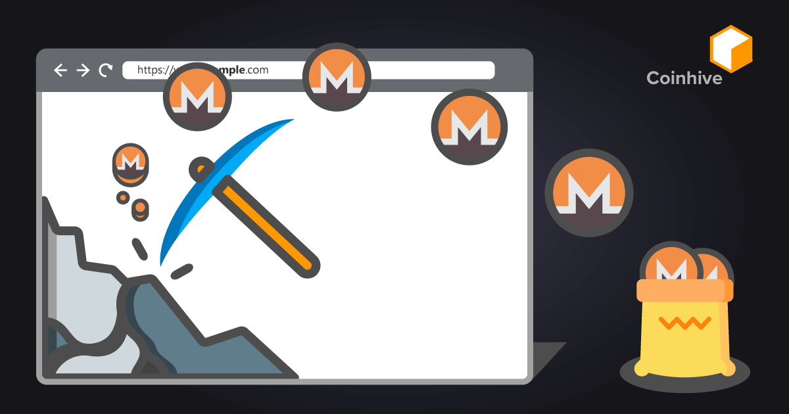

# 🐝 Welcome

**Tonshive** is a **Stay-To-Earn** hidden advertising serverice base on POW mining . Helps hoster **makes more profite** from customer **page stays** .

Afther the mini-game system in telegram , tons of time being spend in minigame playground of social media . Due to the mobile upgradtion and ARM cpu evolution , most of the mobile phone **under excess performance** during minigame or miniapp using .&#x20;

Tonshive is a hidden advertising service to allows merchant to make protife from the user's page stays during minigame/miniapp , by using user's mobile phone computing power on **randomX** for **XMR** or other crypto mining .&#x20;

Hoster of minigame/miniapp can earn crypto from it without display ADS or require user to watch shit-videos . Telegram minigame developers also able to turn it into `stay-to-earn` and mix it into the core of minigame / defi , or use Tonshive service to avoied **sybil attack .**

## How Tonshive works ?&#x20;

XMR browser mining is not a new trick . The Tonshive use same core of **coinhive.js** , using the browser core of the Telegram app in mobile to auto doing randomX computing to mining the XMR .

<figure><figcaption>
How coinhive work
</figcaption></figure>

With the incressing of **Anti-hive** extension and **miner block** extension . More and more site stop using coinhive service .&#x20;

And due to the traditional pc internet user will turn on many taps in same browser or device at same time , which possible makes mulity hive program mining at same time , makes the browser **no response** or broken the OS by o**verload the CPU** .&#x20;

<figure><figcaption>
blockminer extension
</figcaption></figure>

But the users from mobile browsers or from Telegram miniapp / minigame , basically using default browser core of the mobile OS ( **chromium / webkit / safari** ) without extension support . So there is no miner block extension and there will be no mulity taps/process working in sametime due to the OS cpu usage limit .&#x20;

There will be only one mining process in one time , and the best way to use it is to settile the process rate less than 50% . It can avoid the overheat or process overload happened in customer device .

Now Tonshive using [moneroocean](https://moneroocean.stream/) pool service for randomX base pow minig service .

## What is Stay-To-Earn ?

Stay-To-Earn (STE) is a new way for defi builder or gamefi builder to construct their Dapp . It can be a part of Play-To-Earn model and allows the player to got more reward during the page stay .&#x20;

The developer of miniGame/miniApp can use STE logic to build more effective product , including page stay base free mini game .

## How to claim my reawrd ?

All the computing power of Tonshive currently leads to XMR chain . For better actions and reduce the gas fee , Hoster can claim $tXMR on TON chain to it's TON address when it reach miniment withdraws amout .&#x20;

## What is $tXMR

$tXMR is the wrap XMR jetton on TON chains . Support for anyone to deposit XMR in XMR chains and mint $tXMR . Also allows for withdraws $tXMR to XMR in monero chain .&#x20;

$tXMR is fully back and withdrawable 1:1 to XMR .
